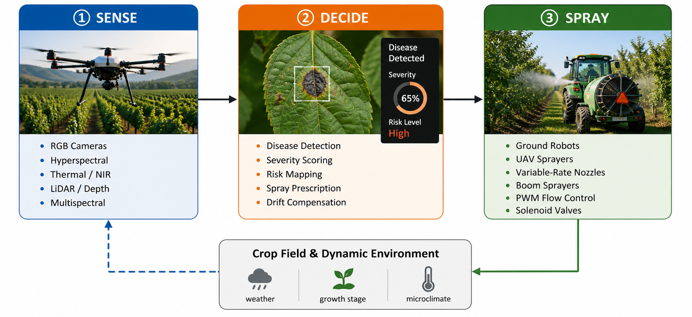
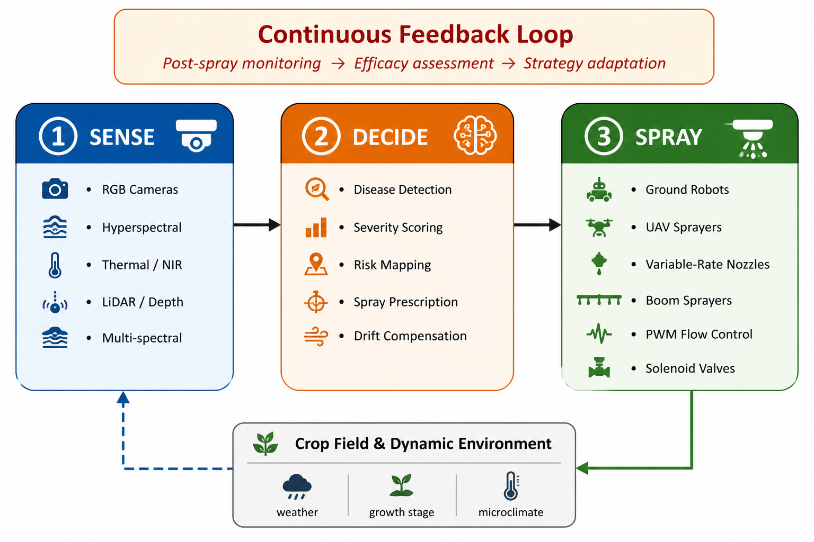
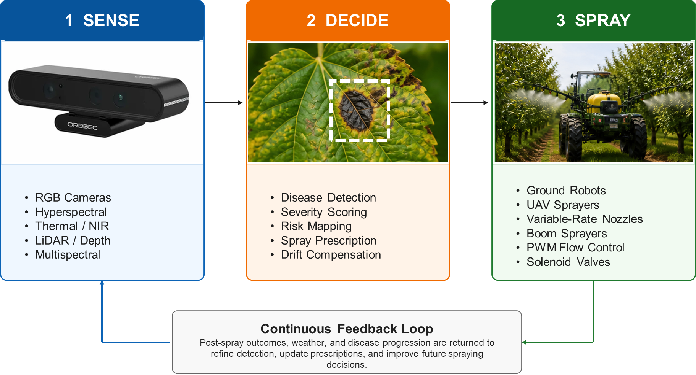
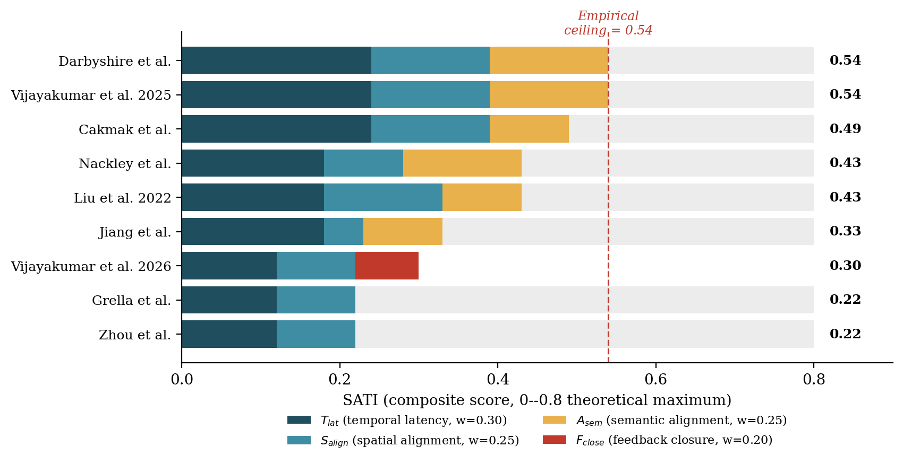
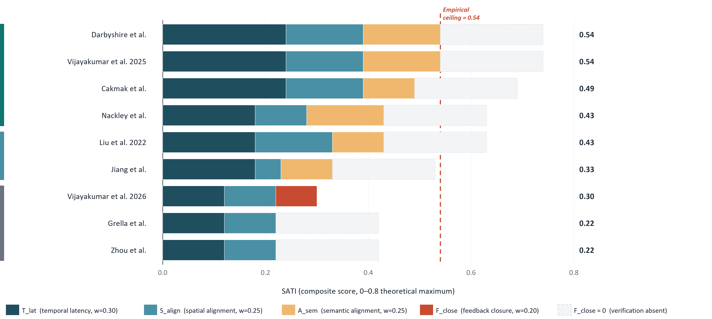

# Advancement in Autonomous Disease Detection and Precision Spraying: A Comprehensive Review

Companion repository for the review paper **"Advancement in Autonomous Disease Detection and Precision Spraying: A Comprehensive Review."** The review synthesises 130 papers (2020–2026) on AI-driven plant disease detection and precision spraying, organised around a **Sense–Decide–Spray (SDS)** closed-loop framework that treats perception, decision-making, and actuation as a single intervention pipeline. This repository provides the machine-readable corpus, the dataset catalogue, the quantitative-instrument data (MCI/GPI and SATI), the featured figures, and the scripts that regenerate them.

## Quick Links

- [Corpus (130 papers)](corpus/corpus_130.csv)
- [Dataset catalogue (27 datasets)](tables/datasets.csv)
- [SATI component scores](tables/sati_scores.csv)
- [Featured figures](#featured-figures)
- [Figure-regeneration scripts](scripts/)
- [Citation](#citation)

## Scope at a Glance

The corpus comprises **130 unique papers** across three core sections:

| Section | Theme | Papers |
| --- | --- | --- |
| Section 4 | AI-based disease detection (47 visual + 22 spectral/physiological) | 69 |
| Section 5 | Precision and autonomous spraying systems | 21 |
| Section 6 | Closed-loop AI detection-to-spraying (44 analytical entries) | 41 |

One platform (Baltazar et al., 2021) contributes to both the spraying and closed-loop sections and is counted once in the deduplicated total of 130. In [`corpus/corpus_130.csv`](corpus/corpus_130.csv) it appears as a single row with the `also_in_section` column flagging its dual membership.

## Corpus

[`corpus/corpus_130.csv`](corpus/corpus_130.csv) lists every reviewed paper with columns: `bibkey`, `reference`, `year`, `section`, `subtheme`, `crop`, `technique`, `key_result`, and `also_in_section`. The `bibkey` matches the citation key in [`references.bib`](references.bib), and `subtheme` allows filtering within each section (e.g. `Visual-VLM`, `Spectral-HSI`, `EndToEnd`, `DecisionIntelligence`, `SensorFusion`).

## Dataset Catalogue

[`tables/datasets.csv`](tables/datasets.csv) is derived from Table 3 of the paper and catalogues the **27 datasets** used across the reviewed studies, including images/samples, disease classes, crops, availability, data type, and access link. A maintenance-friendly link table is in [`docs/dataset_links.md`](docs/dataset_links.md).

## Quantitative Instruments

This review introduces three instruments for comparison beyond classification accuracy:

- **MCI / GPI** — the Modality Complexity Index and Generalisation Potential Index position the 27 datasets in a two-dimensional plane (figure: [`figures/fig_mci_gpi_benchmark.png`](figures/fig_mci_gpi_benchmark.png)).
- **SATI** — the Sensor–Actuation Tightness Index quantifies perception-to-actuation coupling. Component scores `[T_lat, S_align, A_sem, F_close]` for the 9 scored systems are in [`tables/sati_scores.csv`](tables/sati_scores.csv) and reproducible via [`scripts/plot_sati_scores.py`](scripts/plot_sati_scores.py). No surveyed system exceeds **0.54** against a theoretical ceiling of **0.80**; feedback closure is the dominant missing component.
- **Gap taxonomies** — paired perception-side and action-side gap taxonomies, discussed in the paper.

## Featured Figures

### Sense–Decide–Spray framework



The SDS closed-loop framework: sensing, decision-making, and spraying, with a continuous feedback channel returning post-spray outcomes, weather, and disease progression to refine future decisions.

### Annual distribution of the corpus



Annual counts (2020–2026) across the three core sections, showing the 2023–2025 acceleration in foundation-model adoption for detection alongside sustained growth in closed-loop systems. Regenerate with [`scripts/plot_figure2_corpus.py`](scripts/plot_figure2_corpus.py).

### Four-era evolution of visual disease detection



CNN classification → object detection → Vision Transformers → VLM/LLM/MLLM.

### Evolution of precision spraying


Broadcast → spot spraying → CV-driven variable-rate → perception-coupled adaptive.

### SATI: sensor–actuation coupling



Composite SATI scores for the nine scored coupled systems, decomposed into temporal-latency, spatial-alignment, semantic-alignment, and feedback-closure components against the 0.54 empirical ceiling.

### MCI–GPI dataset benchmark and lab-to-field gap




## Reproducing the Figures

```bash
pip install -r requirements.txt
python scripts/plot_figure2_corpus.py    # annual distribution (Figure 2)
python scripts/plot_sati_scores.py       # SATI stacked bars (from tables/sati_scores.csv)
python scripts/plot_latency_budget.py    # spray-window latency budget
```

Outputs are written to `figures/`.

## Citation

```bibtex
@article{Salman2026SDSReview,
  title   = {Advancement in Autonomous Disease Detection and Precision Spraying: A Comprehensive Review},
  author  = {Salman, Muhammad and Ud Din, Muhayy and Hussain, Irfan},
  journal = {TBD},
  year    = {2026},
  note    = {Under review}
}
```

A RIS version is in [`docs/citation.ris`](docs/citation.ris). Please update the DOI and journal fields on acceptance.

## License

Code in this repository is released under the **MIT License** ([`LICENSE`](LICENSE)). The corpus, dataset catalogue, and instrument data are released under **CC-BY-4.0** ([`LICENSE-data`](LICENSE-data)). Featured figures are reproduced from the paper for reference.
